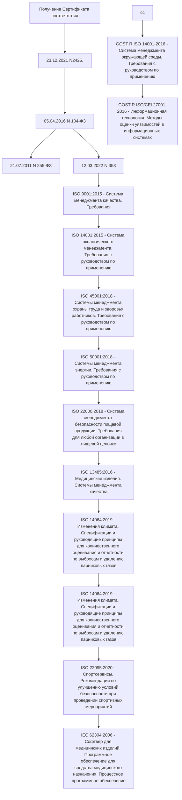

## Задание 2

```mermaid
flowchart TD;
    A[Получение Сертификата соответствия] --> B[23.12.2021 N2425.]
    B --> C[05.04.2016 N 104-ФЗ] --> V[21.07.2011 N 255-ФЗ]
    C --> D[12.03.2022 N 353]
    D --> R[ISO 9001:2015 - Система менеджмента качества. Требования]
    R --> M[ISO 14001:2015 - Система экологического менеджмента. Требования с руководством по применению]
    M --> Z[ISO 45001:2018 - Системы менеджмента охраны труда и здоровья работников. Требования с руководством по применению]
    Z --> X[ISO 50001:2018 - Системы менеджмента энергии. Требования с руководством по применению]
    X --> E[ISO 22000:2018 - Система менеджмента безопасности пищевой продукции. Требования для любой организации в пищевой цепочке]
    E --> L[ISO 13485:2016 - Медицинские изделия. Системы менеджмента качества]
    L --> W[ISO 14064:2019 - Изменения климата. Спецификации и руководящие принципы для количественного оценивания и отчетности по выбросам и удалению парниковых газов]
    W --> AA[ISO 14064:2019 - Изменения климата. Спецификации и руководящие принципы для количественного оценивания и отчетности по выбросам и удалению парниковых газов]
    AA --> bb[ISO 22095:2020 - Спортсервисы. Рекомендации по улучшению условий безопасности при проведении спортивных мероприятий]
    bb --> cc[IEC 62304:2006 - Софтвер для медицинских изделий. Программное обеспечение для средства медицинского назначения. Процессное программное обеспечение]
    сс --> dd[GOST R ISO 14001-2016 - Система менеджмента окружающей среды. Требования с руководством по применению]
    dd --> ee[GOST R ISO/CEI 27001-2016 - Информационная технология. Методы оценки уязвимостей в информационных системах]
   
```
